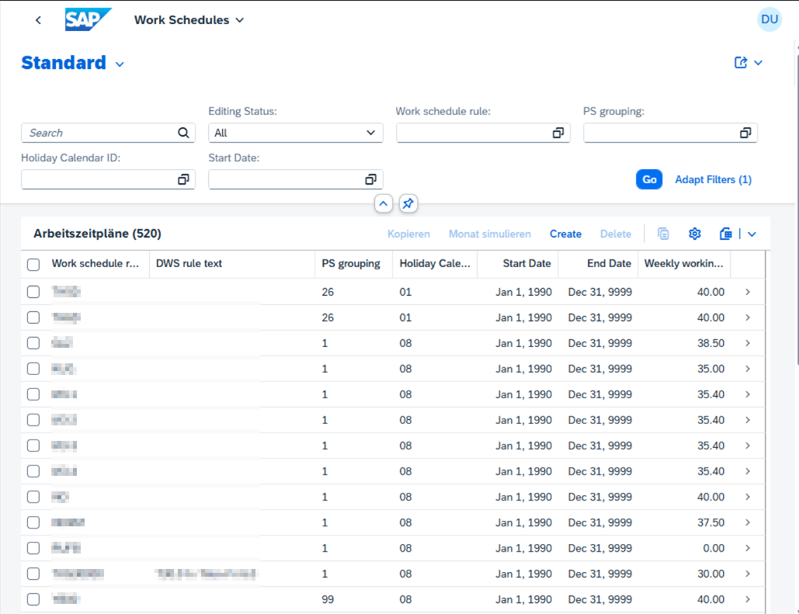
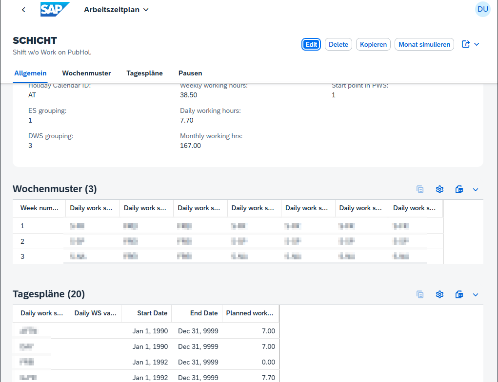

# AZP-Tool – Arbeitszeitplan-Verwaltung (SAP HCM)

Werkzeug zum **Modellieren, Validieren und Pflegen von Arbeitszeitplänen (AZP)** in SAP HCM
(S/4HANA, Modul PT – Personalzeitwirtschaft). Die Logik liegt in ABAP; **SAP GUI** und die
optionale **Fiori-Oberfläche** nutzen denselben Code.

**List Report** – Übersicht und Filter der Arbeitszeitplanregeln (Kopieren, Monat simulieren, Anlegen):



**Object Page** – Detail einer Regel mit Allgemein, Wochenmuster, Tagesplänen und Pausen:



| | |
|---|---|
| **Transaktion** | `ZAZP01` |
| **Report** | `ZAZP01` |
| **Paket** | `ZAZP_HR_TIME` |
| **System (Referenz)** | S4P |
| **Kurztext** | AZP Validierung und Simulation |

---

## Transaktion `ZAZP01`

Einstieg in der SAP GUI:

```text
/nZAZP01
```

| Parameter | Bedeutung |
|---|---|
| `SCHKZ` | Arbeitszeitplanregel (obligatorisch) |
| `ZEITY` / `MOFID` / `MOSID` / `MOTPR` | ES-, Feiertags-, PS- und Tagesplan-Gruppierung |
| Jahr / Monat | für die Monatssimulation |
| Validierung / Simulation | Checkboxen (Standard: beide aktiv) |

**Funktion:** Plausibilitätsprüfung einer Regel (`ZCL_ZAZP_VALIDATION`) und optional
Monatssimulation (`ZCL_ZAZP_GENERATION`). Dieselbe Validierung greift auch über SM30-Events
an den Pflegeviews `V_T508A`, `V_T551A`, `V_T550A`, `V_T550P`.

TCode anlegen (falls noch nicht vorhanden): **SE93** → `ZAZP01` → Startobjekt Programm `ZAZP01`
→ Paket `ZAZP_HR_TIME`. Details: [docu/technisch/AZP-P1-Manuelle-Schritte.md](docu/technisch/AZP-P1-Manuelle-Schritte.md).

---

## Architektur

```
SAP GUI (ZAZP01 / SM30)  ──┐
                           ├── ZCL_ZAZP_* (Validierung, Persist, Transport, Generation, Assignment)
Fiori (RAP / OData V4)  ──┘
         │
         ▼
Customizing: T508A · T551A · T550A · T550P   (+ nativer CTS-Transport)
Stammdaten:  PA0007 (Infotyp 0007)
```

**Objektkette:**

```text
PA0007.SCHKZ → T508A.SCHKZ → T508A.ZMODN → T551A → T550A → T550P
```

---

## Repository-Struktur

```text
AZP_UI/
├── sap/          ABAP-Spiegelung (Paket ZAZP_HR_TIME)
├── app/          Fiori Elements App (+ optional _generator)
├── docu/         Fachliche und technische Dokumentation
├── README.md
└── .gitignore
```

| Ordner | Inhalt |
|---|---|
| [`sap/`](sap/) | Lokale ABAP-Spiegelung (CDS, RAP, Klassen, …) |
| [`app/`](app/) | Fiori-App `azp-workschedulerule/` (+ optional `_generator/`) |
| [`docu/`](docu/) | Fachliche und technische Dokumentation |

Scratch-Ordner `tmp/` / `tmp_abap/` werden **nicht** mehr benötigt und sind entfernt (Inhalt war in `sap/` überführt).

---

## Initiale Einstellung (lokale Entwicklung)

### 1. Fiori-App installieren

```bash
cd app/azp-workschedulerule
npm install
```

### 2. Backend-Zugang (nur für Live-System, nicht für Mock)

Credentials gehören **nicht** ins Git. Die lokalen Run-Configs sind gitignored; im Repo liegen nur die Vorlagen `*.example`:

```bash
cd app/azp-workschedulerule
cp ui5.yaml.example ui5.yaml
cp ui5-local.yaml.example ui5-local.yaml
cp ui5-mock.yaml.example ui5-mock.yaml
```

In `ui5.yaml` / `ui5-local.yaml` unter `backend` setzen:

```yaml
auth: "DEIN_USER:DEIN_PASSWORT"
```

Alternativ Credentials weglassen — Fiori Tools können sie über den **OS-Credential-Store** anfordern.

Für Deploy-Szenarien siehe SAP-Doku zu `credentials` mit `env:…` und optionaler `.env` (Vorlage: [`.env.example`](.env.example); Datei ist gitignored).

Backend-URL und Client stehen in den YAML-Vorlagen (S4P-Lab). Bei anderem System nur URL/Client anpassen.

### 3. App starten

```bash
cd app/azp-workschedulerule
npm run start-mock    # ohne SAP: Mockdaten
# bzw.
npm start             # Live-OData über Proxy (Credentials nötig)
```

FLP-Sandbox-Intent: `azpworkschedulerule-tile`.

### 4. Optional: App neu generieren

Nur nötig, wenn das OData-Modell (EDMX) sich stark ändert und die App neu gescaffoldet werden soll:

```bash
node app/_generator/generate.mjs
```

Danach ggf. lokale Anpassungen (Annotations, Mockdaten) erneut prüfen. Für den normalen Alltag reicht `app/azp-workschedulerule/` — **`_generator` ist optional**.

---

## Braucht man `app/_generator`?

**Nein, nicht zum Betreiben oder Weiterentwickeln der App.** Die lauffähige Anwendung liegt unter `app/azp-workschedulerule/`.

| | |
|---|---|
| **Behalten**, wenn … | ihr die Fiori-App reproduzierbar per SAP Fiori Application Generator (`@sap/fiori:headless`) neu erzeugen wollt (EDMX in `metadata.xml` + `generate.mjs`). |
| **Weglassen möglich**, wenn … | die App fertig ist und nur noch manuell gepflegt wird — dann reichen `app/azp-workschedulerule` + `docu/` + `sap/`. |

`generator-config.json` wird von `generate.mjs` neu geschrieben (enthält u. a. absolute Pfade); `metadata.xml` ist die EDMX-Basis für die Neugenerierung.

---

## Wichtige SAP-Objekte

| Typ | Objekt | Rolle |
|---|---|---|
| Transaktion / Report | `ZAZP01` | Validierung & Monatssimulation (GUI) |
| Klassen | `ZCL_ZAZP_VALIDATION`, `_PERSIST`, `_TRANSPORT`, `_GENERATION`, `_ASSIGNMENT` | Zentrale Logik |
| RAP Actions | `copyAsTemplate`, `simulateMonth`, Transport-*, `readEmployeeAssignment`, `assignEmployee` | Fiori-Aktionen |
| RAP Root | `ZI_ZAZP_WORKSCHEDULERULE` / `ZC_ZAZP_WORKSCHEDULERULE` | Business Object |
| Service Definition | `ZUI_ZAZP_WORKSCHEDULERULE` | OData-Exposition |
| Service Binding (UI) | `ZUI_ZAZP_RULE_UI` | primäre Fiori-Anbindung |
| Service Binding (API) | `ZUI_ZAZP_RULE_O4` | Web-API |
| FUGR / SM30 | `ZAZP_SM30` + Include `ZAZP_SM30_EVENTS` | Validierung beim Speichern in SM30 |
| Nachrichten | `ZAZP` | Meldungstexte (SE91) |

---

## Fiori-App (Kurzreferenz)

Details und Setup: Abschnitt **Initiale Einstellung** oben; App-README: [`app/azp-workschedulerule/README.md`](app/azp-workschedulerule/README.md).

OData-URL (Binding `ZUI_ZAZP_RULE_UI`):

```text
/sap/opu/odata4/sap/zui_zazp_rule_ui/srvd_a2x/sap/zui_zazp_workschedulerule/0001/
```

---

## Dokumentation

- **Übersicht:** [docu/README.md](docu/README.md)
- **Architektur:** [docu/technisch/AZP-Architektur.md](docu/technisch/AZP-Architektur.md) — Schichten, Klassen, RAP, Tabellen
- **Fachlich:** [docu/fachlich/](docu/fachlich/) — Datenmodell, Frontend-Zielbild, Rollen
- **Technisch:** [docu/technisch/](docu/technisch/) — CDS, Services, Objektliste, ToDos, P1-Schritte
- **ABAP-Spiegel:** [sap/README.md](sap/README.md)

Stand: 2026-07-23
