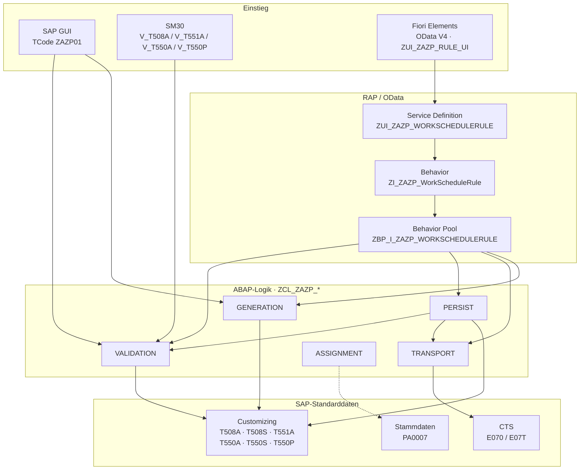
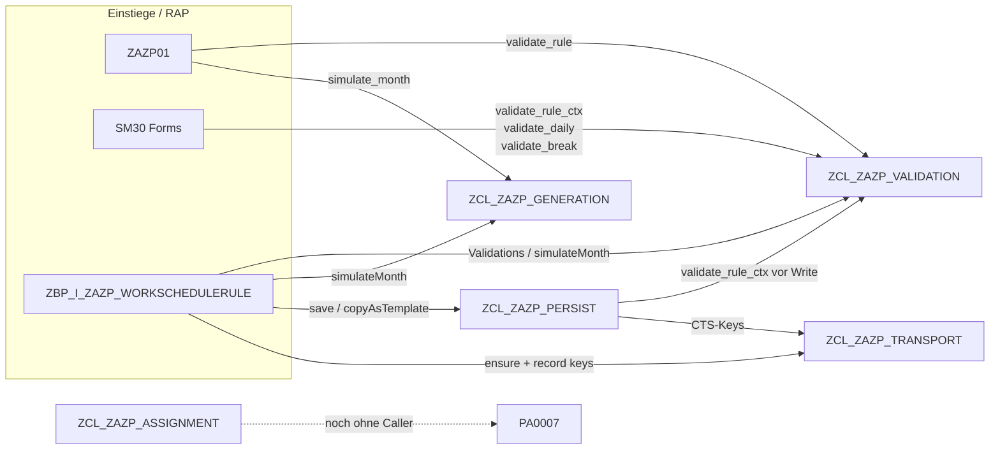
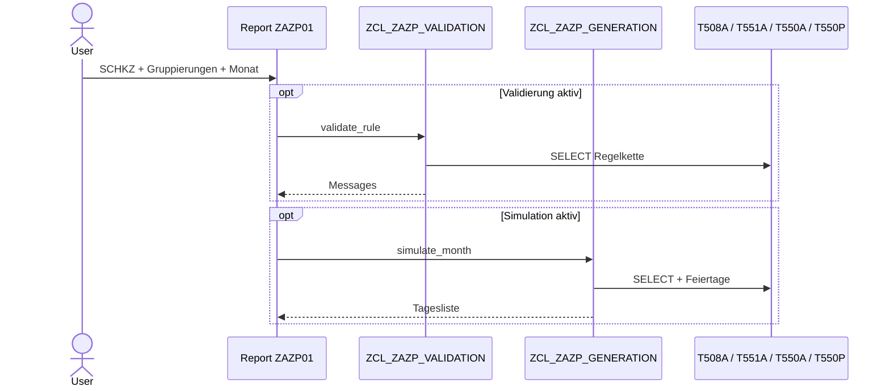
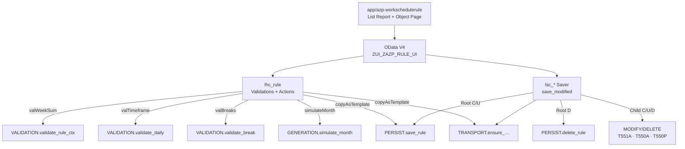
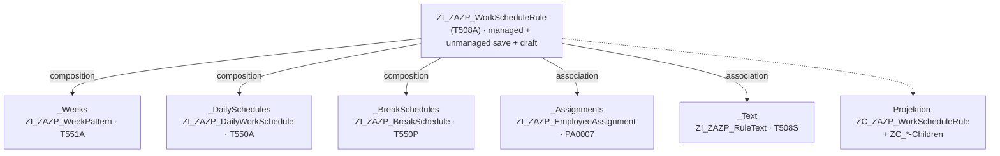
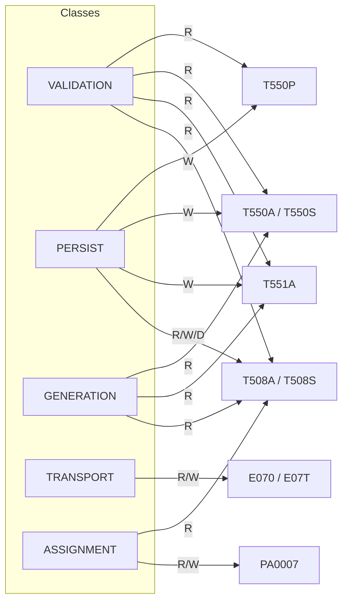

# AZP – Architekturübersicht

Wie die Schichten aufgebaut sind, welche Einstiege welche Klassen rufen und
welche SAP-Tabellen betroffen sind. Paket: **`ZAZP_HR_TIME`**.

> Ergänzend: [Service-Schicht](AZP-Service-Schicht.md) · [CDS-Modell](AZP-CDS-Datenmodell.md) · [Transport](AZP-Transport-Service-Spezifikation.md)

Stand: 2026-07-20

---

## 1. Schichtenmodell

Drei Einstiege, **eine** Logikschicht, **keine** eigenen Z-Datentabellen
(außer Draft-Hilfstabellen für RAP).



`ASSIGNMENT` ist über RAP-Actions `readEmployeeAssignment` / `assignEmployee` und den Fiori-Dialog angebunden (durchgezogene Linie).

---

## 2. Klassen – wer ruft wen?



### Rollen der Klassen

| Klasse | Aufgabe | Wird gerufen von |
|---|---|---|
| **VALIDATION** | Plausibilität Regel / Tagesplan / Pause | ZAZP01, SM30, RAP, PERSIST |
| **PERSIST** | Schreiben/Löschen Customizing + Textte | RAP-Saver, Action `copyAsTemplate` |
| **TRANSPORT** | Offenen Customizing-Auftrag sichern, TABU-Keys | PERSIST, RAP-Saver |
| **GENERATION** | Monatssimulation (nur Lesen/Rechnen) | ZAZP01, RAP-Action `simulateMonth` |
| **ASSIGNMENT** | IT0007 zuordnen (`HR_MAINTAIN_MASTERDATA`) | RAP `assignEmployee` / Fiori-Dialog; GUI: `PA30` |

Unter den `ZCL_ZAZP_*`-Klassen gibt es nur diese Abhängigkeiten:

```text
PERSIST  →  VALIDATION, TRANSPORT
VALIDATION / TRANSPORT / GENERATION / ASSIGNMENT  →  (keine anderen ZCL_ZAZP_*)
```

---

## 3. Einstiege im Detail

### 3.1 Transaktion `ZAZP01`



### 3.2 SM30-Events (FUGR `ZAZP_SM30`)

| View | Form | Aufruf |
|---|---|---|
| `V_T508A` | `ZAZP_VALIDATE_T508A` | `validate_rule_ctx` |
| `V_T551A` | `ZAZP_VALIDATE_T551A` | Parent `T508A` laden → `validate_rule_ctx` |
| `V_T550A` | `ZAZP_VALIDATE_T550A` | `validate_daily` |
| `V_T550P` | `ZAZP_VALIDATE_T550P` | `validate_break` |

### 3.3 Fiori / RAP



---

## 4. RAP Business Object (Composition)



| Element | Bedeutung |
|---|---|
| **Root-Key** | `EsGrouping / HolidayCalendarId / PsGrouping / RuleId / ValidTo` (= T508A-PK) |
| **Draft** | `ZAZP_D_RULE` / `_WEEK` / `_DAILY` / `_BREAK` |
| **Actions** | `copyAsTemplate`, `simulateMonth` |
| **Service** | Rule, Week, Daily, Break, EmployeeAssignment, HolidayCalendar |

---

## 5. Datenzugriff je Klasse



**Objektkette (fachlich):**

```text
PA0007.SCHKZ → T508A.SCHKZ → T508A.ZMODN → T551A
                                          → T550A → T550P
```

---

## 6. Kurz: Weg A vs. Weg B

| Weg | Was | Wer |
|---|---|---|
| **A – Customizing** | Regel + Wochen + Tagespläne + Pausen pflegen | GUI/SM30/Fiori → VALIDATION + PERSIST + TRANSPORT |
| **B – Zuordnung** | Mitarbeiter (IT0007) einer Regel zuweisen | `ASSIGNMENT` + RAP/Fiori verdrahtet |

---

## 7. Repo-Spiegel

| Pfad | Inhalt |
|---|---|
| [`sap/clas/`](../../sap/clas/) | `ZCL_ZAZP_*`, `ZBP_I_ZAZP_WORKSCHEDULERULE` |
| [`sap/prog/`](../../sap/prog/) | `ZAZP01`, SM30-Includes |
| [`sap/ddls/`](../../sap/ddls/) · [`bdef/`](../../sap/bdef/) · [`srvd/`](../../sap/srvd/) | CDS / Behavior / Service |
| [`app/azp-workschedulerule/`](../../app/azp-workschedulerule/) | Fiori Elements App |
